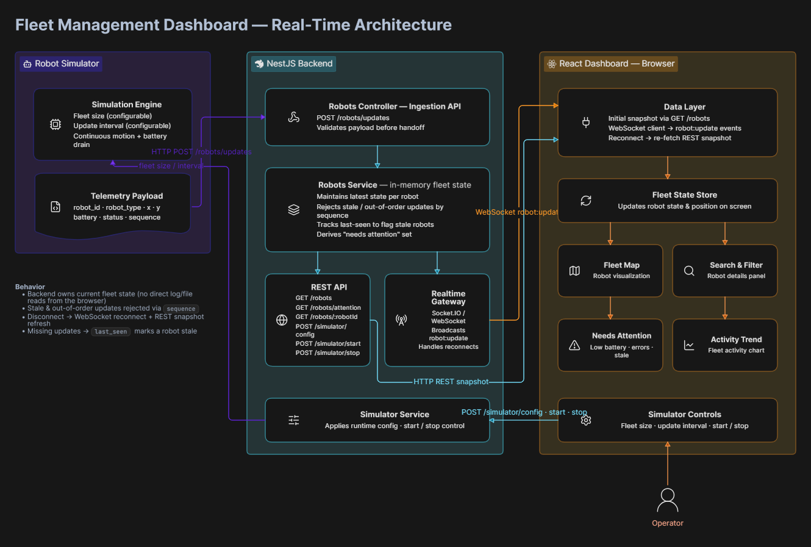

# Architecture

## System Overview

The system consists of three main parts:

1. **Robot Simulator** generates continuous telemetry for each robot.
2. **NestJS Backend** ingests updates, maintains the latest fleet state, and broadcasts changes.
3. **React Dashboard** consumes the backend through REST + WebSocket and renders the live fleet.

## Data Flow

1. The simulator generates a robot update containing:
   `robot_id`, `robot_type`, `x`, `y`, `battery`, `status`, and `sequence`.
2. Updates are sent to `POST /robots/updates`.
3. The backend validates the update and passes it to the Robots Service.
4. The service updates the in-memory state only if the sequence is newer than the last accepted update.
5. The updated state is broadcast through Socket.IO/WebSocket.
6. The dashboard receives the update and changes the robot position/status on the map.
7. On initial load or WebSocket reconnection, the dashboard fetches `GET /robots` to obtain a fresh snapshot.

## Failure Handling

### Robot disconnects

A robot that stops sending updates is detected using its `last_seen` timestamp and can be marked stale/attention-required.

### Late or out-of-order updates

Every robot update contains a sequence number. Older sequences are rejected so stale data cannot overwrite newer state.

### Dashboard disconnects

The dashboard reconnects to the WebSocket. After reconnecting, it fetches the REST snapshot again to ensure its state is current.

### Backend restart

The current fleet state is held in memory, so a backend restart resets the state and the simulator republishes updates. Persistent history was intentionally left out because it is an optional requirement.

## Scaling

The dashboard was tested with fleets up to **500 robots**.

Observed behavior:

- 500 robots / 2000 ms: smooth
- 500 robots / 1000 ms: slight delay after several seconds
- 500 robots / 500 ms: more noticeable delay
- 500 robots / 250 ms: further delay

The current bottleneck is primarily the frequency of updates and the amount of live UI work required to render many robots.

If the fleet grew 10×, I would first move ingestion to a buffered/message-queue based pipeline, separate simulator ingestion from dashboard broadcasting, and optimize/virtualize the map rendering so every robot does not require a full DOM update on every tick.